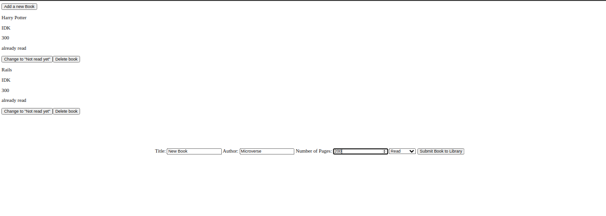

<!-- PROJECT SHIELDS -->
<!--
*** I'm using markdown "reference style" links for readability.
*** Reference links are enclosed in brackets [ ] instead of parentheses ( ).
*** See the bottom of this document for the declaration of the reference variables
*** for contributors-url, forks-url, etc. This is an optional, concise syntax you may use.
*** https://www.markdownguide.org/basic-syntax/#reference-style-links
-->

[![Contributors][contributors-shield]][contributors-url]
[![Forks][forks-shield]][forks-url]
[![Stargazers][stars-shield]][stars-url]
[![Issues][issues-shield]][issues-url]
[![MIT License][license-shield]][license-url]
[![LinkedIn][linkedin-shield]][linkedin-url]

<!-- PROJECT LOGO -->
<br />
<p align="center">
  

  <h3 class ="norse" align="center" style="@font-face {font-family: 'Norse'; src: url('/fonts/Norse.otf'); font-family:'Norse'}">Project 1: Library</h3>

  <p align="center">
    Small Library app
    <br />
    <br />
  </p>
</p>

<!-- TABLE OF CONTENTS -->

## Table of Contents

- [Table of Contents](#table-of-contents)
- [About The Project](#about-the-project)
  - [Built With](#built-with)
- [Getting Started](#getting-started)
  - [Installation](#installation)
- [Usage](#usage)
- [Contact](#contact)

<!-- ABOUT THE PROJECT -->

## About The Project


[Microverse](https://www.microverse.org/) This is the very first project of the Javascript module. It is preceded by the lesson about Objects and the Object Constructor.

Project: JavaScript project, small library app. [Assignment link](https://www.theodinproject.com/courses/javascript/lessons/library)

Visit the finished project website: https://raw.githack.com/jdmartinez1062/Library/feature/library/index.html
<div style="text-align:center">
  <a href="https://raw.githack.com/jdmartinez1062/Library/feature/library/index.html">
      
  </a>
</div>

### Built With

- [JavScrip](https://www.javascript.com)

## Getting Started

### Installation

1. Clone the repo

```sh
git clone https://github.com/jdmartinez1062/Library
```
<!-- USAGE EXAMPLES -->
## Usage

1. Open local server.

2. Click the button "Add a new book"

3. Fill in the proper inputs as requested.

4. Click on "Submit a book to the library".

5. To change the status of "Read or Not" click on the "Change to" button.
   
6. To delete a book from the library, click on "Delete book".

## Contact

Juan David Martínez Cubillos - jd.martinez1062@gmail.com

Carlos Henrique da Veiga - carlosveigadev@gmail.com

Project Link: [https://github.com/jdmartinez1062/Library](https://github.com/jdmartinez1062/Library)


<!-- ACKNOWLEDGEMENTS -->


<!-- MARKDOWN LINKS & IMAGES -->
<!-- https://www.markdownguide.org/basic-syntax/#reference-style-links -->

[contributors-shield]: https://img.shields.io/github/contributors/jdmartinez1062/Library.svg?style=flat-square
[contributors-url]: https://github.com/jdmartinez1062/Library/graphs/contributors
[forks-shield]: https://img.shields.io/github/forks/jdmartinez1062/Library.svg?style=flat-square
[forks-url]: https://github.com/jdmartinez1062/Library/network/members
[stars-shield]: https://img.shields.io/github/stars/jdmartinez1062/Library.svg?style=flat-square
[stars-url]: https://github.com/jdmartinez1062/Library/stargazers
[issues-shield]: https://img.shields.io/github/issues/jdmartinez1062/Library.svg?style=flat-square
[issues-url]: https://github.com/jdmartinez1062/Library/issues
[license-shield]: https://img.shields.io/github/license/jdmartinez1062/Library.svg?style=flat-square
[license-url]: https://github.com/jdmartinez1062/Library/blob/master/LICENSE.txt
[linkedin-shield]: https://img.shields.io/badge/-LinkedIn-black.svg?style=flat-square&logo=linkedin&colorB=555
[linkedin-url]: https://linkedin.com/in/othneildrew
[product-screenshot]: imgs/screenshot.jpg

